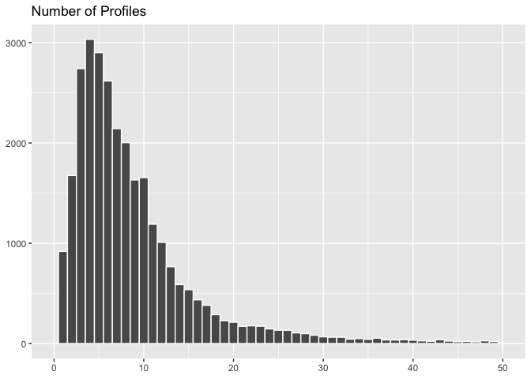
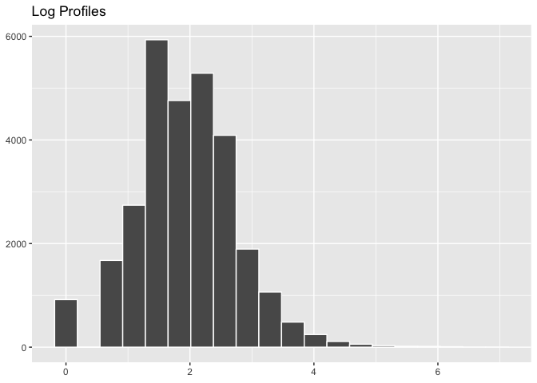
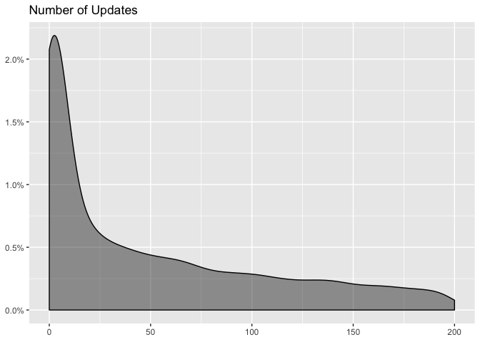
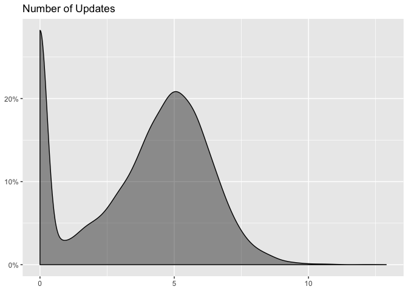
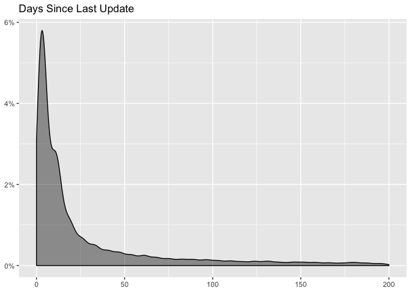
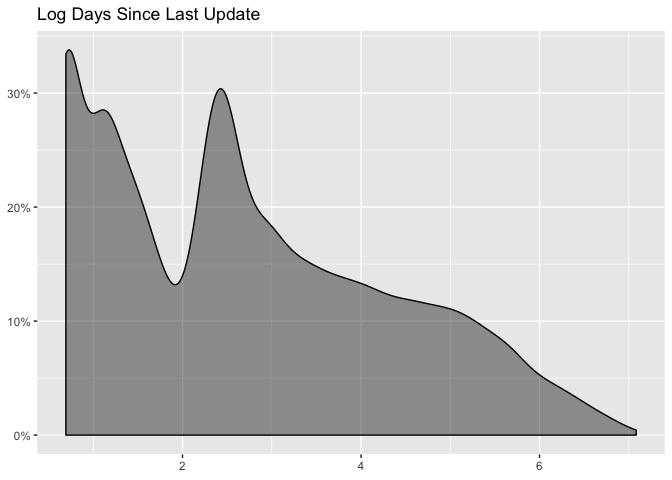
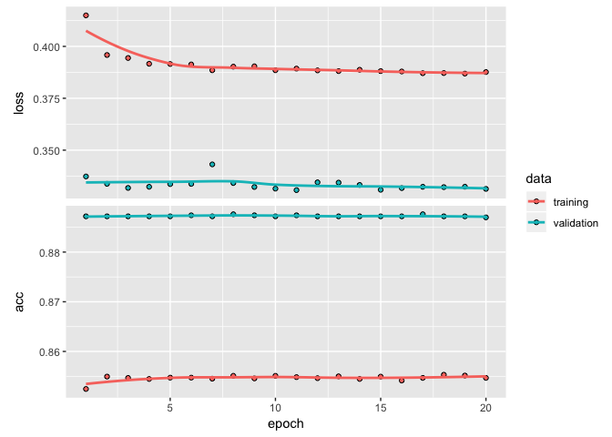
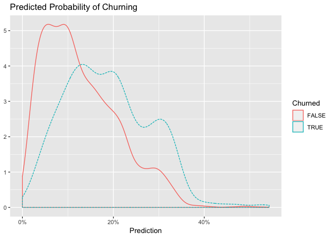

Deep Learning Approach
================

The purpose of this notebook is to explore artificial neural networks (ANN) and their ability to predict churn. The first model has an AUC of 0.69.

The first thing we'll need to do is gather the data from the `data` directory.

``` r
# read data from csv
subs <- read.csv('~/data/features.csv', header = T)
```

Great, we have 74 thousand subscriptions to work with. To evaluate our models, we'll need to split our data into a training and testing set. First, let's simplify by removing subscriptions billed annually. We'll also add a couple features

``` r
# remove yearly subscriptions 
subs <- filter(subs, billing_interval == 'month' & simplified_plan_name != 'reply') %>% 
  mutate(has_team_member = !is.na(number_of_team_members) & number_of_team_members > 0,
         has_refunded_charge = !is.na(number_of_refunded_charges) & number_of_refunded_charges > 0,
         has_failed_charge = !is.na(number_of_failed_charges) & number_of_failed_charges > 0,
         total_updates = total_updates + 1,
         days_since_last_update = days_since_last_update + 1,
         subscription_age = subscription_age + 1,
         did_churn = as.factor(did_churn),
         is_mobile_user = as.factor(is_mobile_user),
         has_team_member = as.factor(has_team_member),
         has_refunded_charge = as.factor(has_refunded_charge),
         has_failed_charge = as.factor(has_failed_charge))
```

We've already done a lot of exploratory analysis in the [logistic regression](https://github.com/bufferapp/churnado/blob/master/notebooks/logistic_regression.md) notebook, so we'll skip that step in this notebook. We can quickly see what this data looks like.

``` r
# glimpse data
glimpse(subs)
```

    ## Observations: 41,407
    ## Variables: 39
    ## $ id                                    <fct> 59f89f4aa73330a12a7b9cce...
    ## $ signup_date                           <fct> 2017-10-31, 2017-10-31, ...
    ## $ locale_browser_language               <fct> en, en, en, en, de, fr, ...
    ## $ number_of_team_members                <int> 0, 4, 4, 0, 0, 0, 0, 0, ...
    ## $ signup_client_name                    <fct> web, web, web, web, web,...
    ## $ signup_option                         <fct> email, email, email, ema...
    ## $ ios_user                              <fct> Yes, Yes, Yes, Yes, Yes,...
    ## $ android_user                          <fct> No, No, No, Yes, No, No,...
    ## $ number_of_profiles                    <int> 7, 5, 5, 4, 5, 5, 11, 11...
    ## $ number_of_twitter_profiles            <int> 1, 1, 1, 0, 1, 0, 2, 5, ...
    ## $ number_of_facebook_personal_profiles  <int> 1, 0, 0, 0, 1, 0, 0, 0, ...
    ## $ number_of_facebook_pages              <int> 1, 2, 1, 1, 2, 1, 2, 5, ...
    ## $ number_of_facebook_groups             <int> 1, 0, 0, 0, 0, 0, 0, 0, ...
    ## $ number_of_instagram_personal_profiles <int> 1, 2, 0, 0, 0, 1, 0, 0, ...
    ## $ number_of_instagram_business_profiles <int> 1, 0, 1, 0, 0, 0, 1, 0, ...
    ## $ created_at                            <fct> 2017-11-08, 2017-11-27, ...
    ## $ subscription_id                       <fct> sub_BjSv1F0oZFo2o4, sub_...
    ## $ plan_id                               <fct> pro-monthly, pro-monthly...
    ## $ quantity                              <int> 1, 1, 1, 1, 1, 1, 1, 1, ...
    ## $ number_of_successful_charges          <int> 8, 7, 8, 7, 2, 2, 3, 8, ...
    ## $ number_of_failed_charges              <int> 1, 0, 1, 0, 2, 0, 0, 3, ...
    ## $ number_of_refunded_charges            <int> 0, 0, 0, 0, 0, 0, 0, 0, ...
    ## $ canceled_at                           <fct> NA, NA, NA, 2018-05-31, ...
    ## $ billing_interval                      <fct> month, month, month, mon...
    ## $ country                               <fct> USA, USA, THA, AUS, DEU,...
    ## $ simplified_plan_name                  <fct> awesome, awesome, busine...
    ## $ did_churn                             <fct> FALSE, FALSE, FALSE, FAL...
    ## $ was_active_end_of_year                <lgl> TRUE, TRUE, TRUE, TRUE, ...
    ## $ was_active_two_months                 <lgl> TRUE, TRUE, TRUE, TRUE, ...
    ## $ days_since_last_update                <dbl> 7, 20, 3, 26, 12, 53, 5,...
    ## $ weeks_with_updates                    <int> 5, 7, 2, 5, 8, 2, 6, 8, ...
    ## $ total_updates                         <dbl> 50, 87, 6, 75, 299, 53, ...
    ## $ updates_per_week                      <dbl> 4.9, 8.6, 0.5, 7.4, 29.8...
    ## $ estimate                              <dbl> -5.372294, -12.008658, 7...
    ## $ subscription_age                      <dbl> 54, 35, 61, 62, 62, 55, ...
    ## $ is_mobile_user                        <fct> TRUE, TRUE, TRUE, TRUE, ...
    ## $ has_team_member                       <fct> FALSE, TRUE, TRUE, FALSE...
    ## $ has_refunded_charge                   <fct> FALSE, FALSE, FALSE, FAL...
    ## $ has_failed_charge                     <fct> TRUE, FALSE, TRUE, FALSE...

Now we'll need to do some preprocessing.

### Data Preprocessing

First, we “prune” the data, which is nothing more than removing unnecessary columns and rows. Then we split into training and testing sets. After that we explore the training set to uncover transformations that will be needed for deep learning.

There are several columns that we won't use so let's drop them from our dataset.

``` r
# drop unneeded columns and remove NAs
subs_pruned <- subs %>% 
  select(-(id:locale_browser_language), 
         -(number_of_twitter_profiles:canceled_at),
         -(was_active_end_of_year:was_active_two_months),
         -country, -ios_user, -android_user, -signup_client_name, -billing_interval) %>% 
  mutate(simplified_plan_name = as.factor(as.character(simplified_plan_name))) %>% 
  filter(signup_option != "" & simplified_plan_name != "") %>% 
  na.omit()

# glimpse data
glimpse(subs_pruned)
```

    ## Observations: 29,336
    ## Variables: 15
    ## $ number_of_team_members <int> 0, 4, 4, 0, 0, 0, 0, 0, 0, 0, 0, 0, 0, ...
    ## $ signup_option          <fct> email, email, email, email, email, face...
    ## $ number_of_profiles     <int> 7, 5, 5, 4, 5, 5, 11, 11, 8, 13, 6, 5, ...
    ## $ simplified_plan_name   <fct> awesome, awesome, business, awesome, aw...
    ## $ did_churn              <fct> FALSE, FALSE, FALSE, FALSE, TRUE, TRUE,...
    ## $ days_since_last_update <dbl> 7, 20, 3, 26, 12, 53, 5, 3, 3, 52, 2, 1...
    ## $ weeks_with_updates     <int> 5, 7, 2, 5, 8, 2, 6, 8, 8, 1, 8, 8, 2, ...
    ## $ total_updates          <dbl> 50, 87, 6, 75, 299, 53, 90, 319, 555, 6...
    ## $ updates_per_week       <dbl> 4.9, 8.6, 0.5, 7.4, 29.8, 5.2, 8.9, 31....
    ## $ estimate               <dbl> -5.372294, -12.008658, 7.268398, -22.12...
    ## $ subscription_age       <dbl> 54, 35, 61, 62, 62, 55, 61, 62, 59, -30...
    ## $ is_mobile_user         <fct> TRUE, TRUE, TRUE, TRUE, TRUE, FALSE, FA...
    ## $ has_team_member        <fct> FALSE, TRUE, TRUE, FALSE, FALSE, FALSE,...
    ## $ has_refunded_charge    <fct> FALSE, FALSE, FALSE, FALSE, FALSE, FALS...
    ## $ has_failed_charge      <fct> TRUE, FALSE, TRUE, FALSE, TRUE, FALSE, ...

That's better. Now let's split the data into training and testing sets.

``` r
# set seed for reproducibility
set.seed(200)

# set random groups
subs_pruned$rgroup <- runif(dim(subs_pruned)[[1]])

# split out training and testing sets
training <- subset(subs_pruned, rgroup <= 0.8) %>% select(-rgroup)
testing <- subset(subs_pruned, rgroup > 0.8) %>% select(-rgroup)
```

Great, now we'll need to make a few transformations. In general, ANNs work best when the data is one-hot encoded, scaled and centered. In addition, other transformations may be beneficial as well to make relationships easier for the algorithm to identify.

Let's look at the number of profiles as an example.



We can see that this is skewed to the left. Let's see if we can spread the data out more by applying a log transformation.



This is a better looking distribution. Let's see if this transformation increases the correlation with `did_churn`.

``` r
# determine if log transformation improves correlation with churn
training %>%
  select(did_churn, number_of_profiles) %>%
  mutate(did_churn = did_churn %>% as.factor() %>% as.numeric(),
         log_profiles = log(number_of_profiles)) %>%
  correlate() %>%
  focus(did_churn) %>%
  fashion()
```

    ##              rowname did_churn
    ## 1 number_of_profiles      -.03
    ## 2       log_profiles      -.05

It doubles the magnitude of correlation. Now let's look at updates.



We can see that this distribution is also scaled to the left. Let's apply a variation of the log transformation - we'll add 1 before taking the log so that `log(1) = 0` will be included.



Alright, getting there. Let's see if this transformation increases the correlation with `did_churn`.

``` r
# determine if log transformation improves correlation with churn
training %>%
  select(did_churn, total_updates) %>%
  mutate(did_churn = did_churn %>% as.factor() %>% as.numeric(),
         log_updates = log(total_updates)) %>%
  mutate(log_updates = replace(log_updates, log_updates == -Inf, 0)) %>%  
  correlate() %>%
  focus(did_churn) %>%
  fashion()
```

    ##         rowname did_churn
    ## 1 total_updates      -.02
    ## 2   log_updates      -.13

It does increase the magnitude of correlation. This will be useful for us. Let's finally look at the number of days since the user's last update.



Apply a log transformation.



A little better. Let's see if this increases correlation with churn.

``` r
# determine if log transformation improves correlation with churn
training %>%
  select(did_churn, days_since_last_update) %>%
  mutate(did_churn = did_churn %>% as.factor() %>% as.numeric(),
         log_days_since_last_update = log(days_since_last_update)) %>%
  mutate(days_since_last_update = replace(days_since_last_update, days_since_last_update == -Inf, 0)) %>%  
  correlate() %>%
  focus(did_churn) %>%
  fashion()
```

    ##                      rowname did_churn
    ## 1     days_since_last_update       .06
    ## 2 log_days_since_last_update       .13

It does.

### ML Recipe

We'll create a recipe to make transformations, one-hot encode, and scale the data. One-hot encoding is the process of converting categorical data to sparse data, which has columns of only zeros and ones (dummy variables). All non-numeric data will need to be converted to dummy variables.

``` r
# create recipe
rec <- recipe(did_churn ~ ., data = training) %>%
  step_log(total_updates) %>%
  step_log(number_of_profiles) %>% 
  step_log(days_since_last_update) %>% 
#  step_log(subscription_age) %>% 
  step_dummy(all_nominal(), -all_outcomes()) %>%
  step_center(all_predictors(), -all_outcomes()) %>%
  step_scale(all_predictors(), -all_outcomes()) %>%
  prep(data = training)
```

Now let's create vectors for the response variable.

``` r
# response variables for training and testing sets
y_training <- ifelse(pull(training, did_churn) == TRUE, 1, 0)
y_testing  <- ifelse(pull(testing, did_churn) == TRUE, 1, 0)
```

Now let's bake with our recipes.

``` r
# predictors
x_train_tbl <- bake(rec, newdata = training) %>% select(-did_churn)
x_test_tbl  <- bake(rec, newdata = testing) %>% select(-did_churn)
```

### Building the Network

``` r
# build model
model <- keras_model_sequential() %>% 
  layer_dense(units = 32, activation = "relu", input_shape = ncol(x_train_tbl)) %>% 
  layer_dropout(rate = 0.1) %>% 
  layer_dense(units = 32, activation = "relu") %>% 
  layer_dropout(rate = 0.1) %>% 
  layer_dense(units = 1, activation = "sigmoid")
```

Now let's configure the model.

``` r
model %>% compile(
  optimizer = "rmsprop",
  loss = "binary_crossentropy",
  metrics = c("accuracy")
)
```

Now let's train the model for 20 epochs.

``` r
history <- model %>% fit(
  x = as.matrix(x_train_tbl),
  y = y_training,
  batch_size = 50,
  epochs = 20,
  validation_split = 0.20
)
```

The model seems to start overfitting pretty quickly. Let's plot the model's performance.

``` r
# plot model performance
plot(history)
```



Now let's make predictions on the testing set.

``` r
# make predictions
testing$pred <- predict_proba(object = model, x = as.matrix(x_test_tbl)) %>% as.vector()
```

Cool. Let's quickly make a double density plot.



That's somewhat promising. What threhold should we use? Let's calculate AUC.

``` r
# define what a positive result is
pos <- TRUE

# function to calculate AUC
calcAUC <- function(predcol, outcol) {
  
  perf <- performance(prediction(predcol, outcol == pos), 'auc') 
  as.numeric(perf@y.values)
  
}

# calculate AUC
calcAUC(testing[, "pred"], testing[, "did_churn"])
```

    ## [1] 0.6849915

AUC of 0.69. Just barely above that of the logistic regression model.
