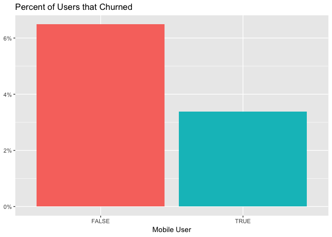

Churn Features
================

Summary
-------

The purpose of this notebook is to gather and explain the features that we'll use in our churn prediction model. The final dataset will include the following features for all *Stripe* subscriptions that were active on December 31, 2017:

-   user's signup date
-   browser language
-   number of team members
-   signup client
-   signup option
-   whether the user used the iOS app
-   whether the user used the Android app
-   whether the user used either mobile app
-   number of profiles
-   number of active twitter profiles
-   number of active facebook personal profiles
-   number of active facebook pages
-   number of active facebook groups
-   number of active instagram personal profiles
-   number of active instagram business profiles
-   subscription creation date
-   plan id
-   simplified plan id
-   quantity
-   number of successful charges
-   number of failed charges
-   number of refunded charges
-   billing interval
-   credit card country
-   total number of updates sent between October 15, 2017 and January 1, 2018
-   number of days since last update before January 1, 2018
-   number of distinct weeks with updates in that timeframe
-   average updates per week in that timeframe
-   growth coefficient of the number of updates per week
-   age of the subscription on December 31, 2017

The `did_churn` variable indicates whether or not the subscription was canceled by March 1, 2018. This means that our predictive models will try to determine the likelihood of a subscription being canceled within two months.

The final dataset is exported as a csv to the `data` directory.

Data collection
---------------

We'll grab the data we need for the analysis from [this Look](https://looker.buffer.com/looks/4497). The SQL query takes to long to run for it to be used within this notebook. We'll read in the data from a CSV. All of the subscriptions were created in the year 2017.

``` r
# read data from CSV
churn_df <- read.csv('~/Downloads/churn_features.csv', header = T)
```

We have around 78 thousand subscriptions in our dataset. Let's clean up the data a bit and get it ready for analysis.

``` r
# remove first column 
churn_df$X <- NULL

# rename columns
colnames(churn_df) <- safe_names(colnames(churn_df))

# rename columns with dplyr
churn_df <- churn_df %>% 
  rename(ios_user = is_ios_user_yes_no_,
         android_user = is_android_user_yes_no_,
         quantity = number_of_subscription_seats,
         signup_date = created_at_date,
         created_at = created_at_date_1,
         canceled_at = canceled_at_date)

# set dates as date objects
churn_df$signup_date <- as.Date(churn_df$signup_date, "%Y-%m-%d")
churn_df$created_at <- as.Date(churn_df$created_at, "%Y-%m-%d")
churn_df$canceled_at <- as.Date(churn_df$canceled_at, "%Y-%m-%d")
```

Great. Now we want to add a variable that indicates whether the subscription churned within two months of January 1, 2018. We'll also only want to look at subscriptions that were active at the end of the year. Also, to make sure we're comparing apples to apples, we'll make sure that each subscription was active for at least two months.

``` r
# indicate if subscription churned
churn_df <- churn_df %>% 
  mutate(did_churn = !is.na(canceled_at) & canceled_at <= '2018-03-01',
         was_active_end_of_year = is.na(canceled_at) | canceled_at >= '2018-01-01',
         was_active_two_months = signup_date <= '2017-10-31') %>% 
  filter(was_active_end_of_year & was_active_two_months)
```

Alright, we're down to around 74 thousand subscriptions in our dataset. Now, let's gather data on the number of updates these users sent. We only want updates sent by users in our `churn_df` dataframe.

``` r
# get user ids
user_ids <- paste(shQuote(churn_df$id), collapse = ',')

# remove double quotes
user_ids <- as.factor(noquote(user_ids))
```

``` r
# connect to redshift
con <- redshift_connect()
```

``` sql
select
  user_id
  , date(date_trunc('week', created_at)) as week
  , count(distinct id) as updates
from dbt.updates
where user_id in (?user_ids)
and was_sent_with_buffer
and created_at >= '2017-10-15' and created_at <= '2018-01-01'
group by 1, 2
```

Sweet, that actually worked! Now let's get the number of days that had passed between the the users' last updates and December 31, 2017.

``` sql
with last_update_date as (
  select
    user_id
    , max(created_at) as last_update_date
  from dbt.updates
  where user_id in (?user_ids)
  and was_sent_with_buffer
  and created_at <= date('2017-12-31')
  group by 1
)
select
  user_id
  , datediff(days, last_update_date, date('2017-12-31')) as days_since_last_update
from last_update_date
```

``` r
# set count as integer
last_update <- last_update %>% 
  mutate(days_since_last_update = as.integer(days_since_last_update))
```

Now we want to calculate the "slopes", i.e. how the number of weekly updates sent with Buffer changed over time for these users. First, let's make sure that there is a value for each user and each week.

``` r
# complete the data frame
updates <- updates %>%
  mutate(updates = as.numeric(updates)) %>% 
  filter(week != max(week) & week != min(week)) %>%
  complete(user_id, week, fill = list(updates = 0))
```

Join `last_update` dataframe to `churn_df` so that we have the number of dyas since last update for each user.

``` r
# join last update date
churn_df <- churn_df %>% 
  left_join(last_update, by = c('id' = 'user_id'))

# remove last update dataframe
rm(last_update)
```

Now let's fit linear models to the users' update counts so that we can get growth coefficients for each.

``` r
# get the year
by_user <- updates %>% 
  group_by(week, user_id) %>% 
  summarise(updates = sum(updates, na.rm = TRUE)) %>% 
  mutate(year = year(week) + yday(week) / 365) %>% 
  ungroup()

# create logistic regression model
mod <- ~ lm(updates ~ year, .)

# calculate growth rates for each user (this might take a while)
slopes <- by_user %>%
  nest(-user_id) %>%
  mutate(model = map(data, mod)) %>%
  unnest(map(model, tidy)) %>%
  filter(term == "year") %>%
  arrange(desc(estimate))
```

Let's plot users' updates and order them by their growth coefficients.


Cool! These users' update counts have all increased. Now let's look at the users with the lowest growth coefficients.


This is what we were expecting to see. Now let's calculate summary stats for users' update counts and join in the slopes.

``` r
# aggregate users update counts
by_user <- updates %>% 
  group_by(user_id) %>% 
  summarise(weeks_with_updates = length(updates[updates > 0]),
            total_updates = sum(updates),
            updates_per_week = sum(updates) / n_distinct(week)) %>% 
  inner_join(select(slopes, user_id, estimate), by = "user_id")
```

Great! We seem to be missing update data for around 10 thousand users. Let's quickly check on a couple of those.

``` r
churn_df %>% 
  anti_join(by_user, by = c('id' = 'user_id')) %>% 
  select(id) %>% 
  head()
```

    ##                         id
    ## 1 59f8b41b186f65734acedb8b
    ## 2 59f90948513d8d1939dd92da
    ## 3 59f7c960a73330433f6afd1f
    ## 4 59f86485186f65ee2de86c7f
    ## 5 59f738c8513d8df35e5d7d8e
    ## 6 59f6ea75dc8ca5fd4e78b6cb

Indeed, these users have no updates during the selected time period. Let's join this data into our original dataframe.

``` r
# join in updates data
churn_df <- churn_df %>% 
  left_join(by_user, by = c('id' = 'user_id'))
```

Now let's replace NAs with 0s

``` r
# replace NAs with 0s
churn_df$weeks_with_updates[is.na(churn_df$weeks_with_updates)] <- 0
churn_df$total_updates[is.na(churn_df$total_updates)] <- 0
churn_df$updates_per_week[is.na(churn_df$updates_per_week)] <- 0
churn_df$estimate[is.na(churn_df$estimate)] <- 0
churn_df$number_of_team_members[is.na(churn_df$number_of_team_members)] <- 0

# remove unneeded data frames
rm(by_user)
rm(slopes)
rm(updates)
```

Sweet. Now we can generate a couple more features. First we want to know the subscrpition age at the time of measurement (December 31, 2017). Remember, we're trying to predict the subscriptions that churn within two months of this date.

``` r
# get subscription age
churn_df <- churn_df %>% 
  mutate(subscription_age = as.numeric(as.Date('2017-12-31') - created_at))

# determine if user is a mobile user
churn_df <- churn_df %>% 
  mutate(is_mobile_user = ios_user == "Yes" | android_user == "Yes")
```

Now, let's save this dataframe and do a bit of exploratory analysis.

``` r
# write data as csv
write.csv(churn_df, file = "data/features.csv", row.names = FALSE)
```

Exploratory Analysis
--------------------

First off, let's see the proportion of users that churned in our time frame.

``` r
churn_df %>% 
  count(did_churn) %>% 
  mutate(percent = n / sum(n))
```

    ## # A tibble: 2 x 3
    ##   did_churn     n percent
    ##   <lgl>     <int>   <dbl>
    ## 1 F         66710  0.901 
    ## 2 T          7314  0.0988

Around 13% of the users in our dataset churned within two months of January 1, 2018. There are only around 4000 users, which isn't a lot. Now let's look at some of our features.

### Updates

Let's look at how the number of updates is distributed.


We can see that a greater proportion of churned users had zero updates in the time period. Both of these distributions appear to be power-law distributed, so it may make sense to apply a transformation. A log transformation would make sense, but we need to figure out what to do with the zeroes. One approach would be to take `log(updates + 1)`, which would conveniently map the zeroes to 0. Let's try it.


Interesting, we can see that users that churned seem to have less updates. What if we removed users with zero updates altogether?


This is much better. Now let's look at the growth coefficients of updates per week for churned and non-churned users.


That's interesting. A much higher percentage of churned users had a growth coefficient of zero, probably because they had no updates in the time period. What if we took the square root of this data?


Interesting. There appears to be a higher percentage of non-churned users with a positive growth coefficient. Let's shift and look at the number of profiles.

### Profiles

We'll visualize the distribution of the number of profiles users have. I'm guessing that this won't be too useful of a feature, but let's see.


Cool, let's apply a log transformation here because the data is so skewed.


These distributions look very similar, which is what we expected. Let's see if there is any correlation between churn and whether the user was a mobile user.



It seems that there is a correlation there. Let's look at the subscription age now.

### Subscription Age


This is interesting. There's something going on with annual subscriptions. Let's normalize this data.


Huh.
