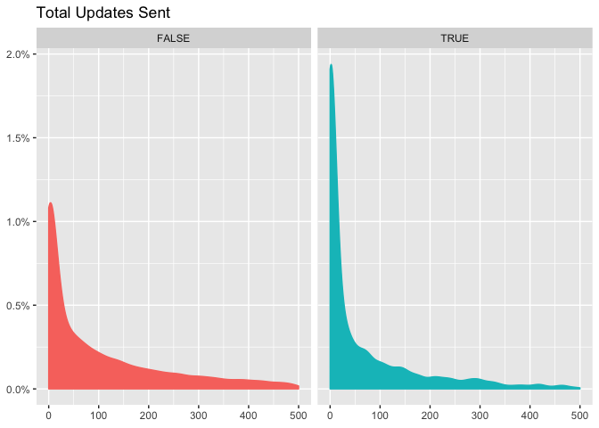
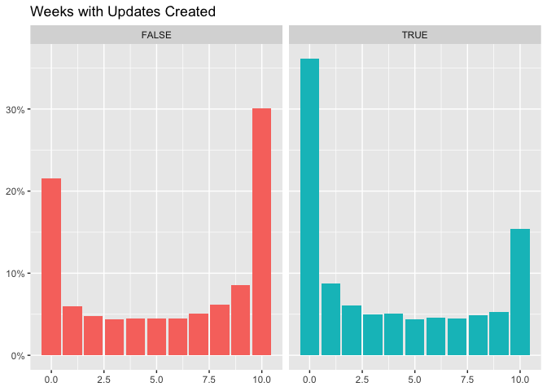
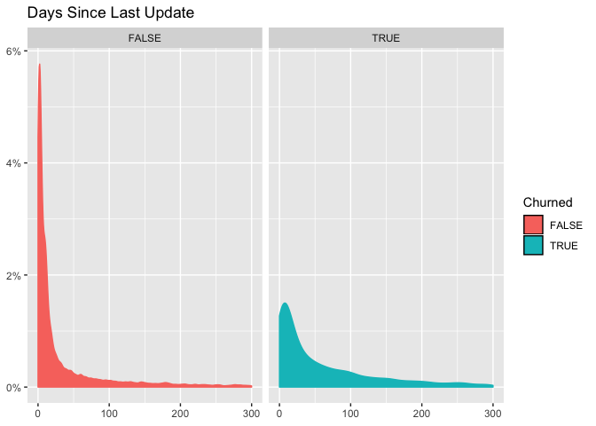
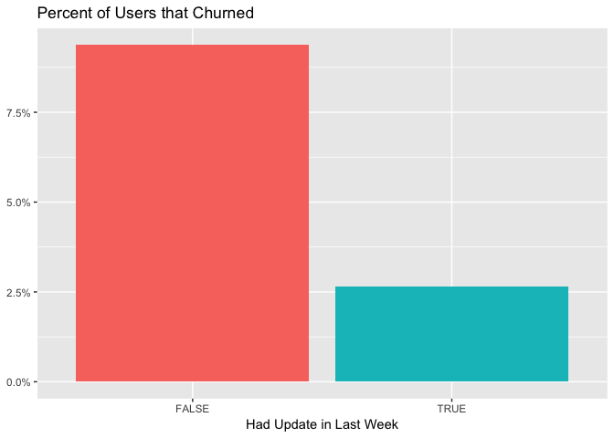

Logistic Regression Models
================

The purpose of this notebook is to explore logistic regression models to establish a baseline model performance and determine which features correlate best with the likelihood of churning. The final model identifies a set of potential at-risk subscriptions that finds about 56% of all the true at-risk subscriptions, with a true positive rate around 90% higher than the overall population rate. The AUC calculated on the testing set is **0.72**.

The first thing we'll need to do is gather the data from the `data` directory.

``` r
# read data from csv
subs <- read.csv('~/Documents/GitHub/churnado/data/features.csv', header = T)
```

Great, we have 74 thousand subscriptions to work with. To evaluate our models, we'll need to split our data into a training and testing set. First, let's simplify by removing subscriptions billed annually.

``` r
# remove yearly subscriptions 
subs <- filter(subs, billing_interval == 'month' & simplified_plan_name != 'reply' &
                 !is.na(simplified_plan_name) & simplified_plan_name != '')

# set dates
subs$created_at <- as.Date(subs$created_at, format = '%Y-%m-%d')
subs$canceled_at <- as.Date(subs$canceled_at, format = '%Y-%m-%d')
subs$signup_date <- as.Date(subs$signup_date, format = '%Y-%m-%d')
```

Exploratory Analysis
--------------------

We'll want to be selective with the features we use in our model, so let's do some exploratory analysis to see what's going on with the features. We'll start by looking at the total number of updates sent.

### Updates

Let's look at how the number of updates is distributed.



We can see that a greater proportion of churned users had zero updates between October 15, 2017 and January 1, 2018. Both of these distributions appear to be power-law distributed, so it may make sense to apply a transformation. A log transformation would make sense, but we need to figure out what to do with the zeroes. One approach would be to take `log(updates + 1)`, which would conveniently map the zeroes to 0. Let's try it.


Interesting, we can see that users that churned seem to have less updates. What if we removed users with zero updates altogether?


This looks better. Now let's graph the growth coefficients of updates per week for churned and non-churned users.


That's interesting. A much higher percentage of churned users had a growth coefficient of zero, probably because they had no updates in the time period.

Let's take a look at the number of weeks in which users sent updates.



This is useful to see. A higher percentage of users that *didn't* churn created updates in all 8 weeks. A higher percentage of users that did churn didn't create updates in any of the weeks. It should be useful to include this feature in the final model. It may even make sense to use it as a *categorical* variable. We'll also add a boolean variable `no_updates` that indicates whether the user didn't have any updates in the time period.

Let's shift and have a look at profiles.

### Profiles

We'll visualize the distribution of the number of profiles users have. I'm guessing that this won't be too useful of a feature, but let's see.


Cool, let's apply a log transformation here because the data is so skewed.


These distributions look very similar, which is what we expected. I don't think that this will be an especially helpful feature to include in the model. Let's compare churn rates of users that have used the mobile apps to that of users that did not.

### Mobile Users

Let's see if there is any correlation between churn and whether the user was a mobile user.


It seems that there is a correlation there. Users that used one of the mobile apps churned at a significantly lower rate. That's cool. Let's look at the subscription age now.

### Subscription Age

Let's create the double density plot.


This is interesting. It seems like a higher percentage of churned subscriptions were "younger". If we normalize this metric we can see that more clearly.


Now let's look at the number of days since the user's last update.

### Days Since Last Update

We'll create another double density plot to compare the metrics for churned and non-churned subscriptions.



This is great, we can see that a much higher percentage of non-churned users created an update on the last day, signalling that they were active on the last day. Let's visualize this again with a CDF.


This is good. We might also create a categorical variable that indicates whether the user created an update in the most recent 7 days.



Perfect. Now let's take a look at team members.

### Team Members


This isn't helpful. Let's created a categorical variable that indicates whether or not a user has a team member.

Now let's take a look at the numebr of charges that subscriptions had.

### Failed Charges

We'll start by looking at the number of failed charges that customers had.


This isn't helpful. Let's create a categorical variable that tells us if the customer had any failed charges. We'll do the same for refunded charges.


Huh, that is counterintuitive, but there does appear to be a difference there.


Wait, what? It seems that if a customer had a refunded charge they may be *less* likely to churn. This is counterintuitive, but may be useful in our model.

Data Partitioning
-----------------

Now let's split our data into training and testing sets.

``` r
# get user age at time subscription started
subs <- subs %>% 
  mutate(user_age = as.numeric(created_at - signup_date))

# change values of did_churn
subs <- subs %>% 
  mutate(did_churn = ifelse(did_churn, 1, 0),
         is_idle = as.factor(is_idle))

# set seed for reproducible results
set.seed(2356)

# set random groups
subs$rgroup <- runif(dim(subs)[[1]])

# split out training and testing sets
training <- subset(subs, rgroup <= 0.8)
testing <- subset(subs, rgroup > 0.8)
```

Great, 80% of our data was put into a training set and the remaining 20% in a testing set. Now let's build our regression model.

### Logistic Regression

First we'll need to decide which features to include in our model.

``` r
# list features
features <- c('has_team_member', 'is_mobile_user', 'number_of_profiles', 'has_refunded_charge',
              'has_failed_charge', 'updates_past_week', 'estimate', 'weeks_with_updates',
              'estimate', 'total_updates', 'simplified_plan_name', 'scale(subscription_age)',
              'is_idle', 'signup_client_name', 'has_billing_actions', 'has_analytics_actions',
              'user_age')

# collapse list to string
feature_string <- paste(features, collapse = ' + ')

# model formula
formula <- paste0('did_churn ~ ', feature_string)
formula
```

    ## [1] "did_churn ~ has_team_member + is_mobile_user + number_of_profiles + has_refunded_charge + has_failed_charge + updates_past_week + estimate + weeks_with_updates + estimate + total_updates + simplified_plan_name + scale(subscription_age) + is_idle + signup_client_name + has_billing_actions + has_analytics_actions + user_age"

Let's build our first model.

``` r
# first model
logreg <- glm(formula = formula, data = training, family = binomial(link = "logit"))
```

Now let's summarize the model.

``` r
summary(logreg)
```

    ## 
    ## Call:
    ## glm(formula = formula, family = binomial(link = "logit"), data = training)
    ## 
    ## Deviance Residuals: 
    ##     Min       1Q   Median       3Q      Max  
    ## -1.4034  -0.5514  -0.4016  -0.2772   3.1898  
    ## 
    ## Coefficients:
    ##                                        Estimate Std. Error z value
    ## (Intercept)                          -1.427e+00  5.860e-02 -24.350
    ## has_team_memberTRUE                  -3.741e-01  7.389e-02  -5.063
    ## is_mobile_userTRUE                   -6.204e-01  4.319e-02 -14.366
    ## number_of_profiles                   -2.369e-04  1.285e-03  -0.184
    ## has_refunded_chargeTRUE               1.123e+00  9.480e-02  11.848
    ## has_failed_chargeTRUE                -2.145e-01  4.174e-02  -5.138
    ## updates_past_weekTRUE                -1.682e-01  5.608e-02  -3.000
    ## estimate                             -3.677e-05  2.221e-05  -1.656
    ## weeks_with_updates                   -8.883e-02  7.861e-03 -11.300
    ## total_updates                         2.437e-06  3.919e-06   0.622
    ## simplified_plan_namebusiness         -2.715e-01  8.279e-02  -3.279
    ## scale(subscription_age)              -4.337e-01  3.090e-02 -14.034
    ## is_idleTRUE                           2.564e-02  5.694e-02   0.450
    ## signup_client_nameBuffer for Android  2.608e-01  1.772e-01   1.472
    ## signup_client_nameBuffer for iOS      2.006e-02  1.543e-01   0.130
    ## signup_client_nameBuffer for Kindle  -8.144e+00  8.445e+01  -0.096
    ## signup_client_nameweb                 1.086e-02  5.645e-02   0.192
    ## has_billing_actionsTRUE               8.111e-01  4.438e-02  18.276
    ## has_analytics_actionsTRUE            -8.011e-02  4.726e-02  -1.695
    ## user_age                              7.357e-05  5.084e-05   1.447
    ##                                      Pr(>|z|)    
    ## (Intercept)                           < 2e-16 ***
    ## has_team_memberTRUE                  4.13e-07 ***
    ## is_mobile_userTRUE                    < 2e-16 ***
    ## number_of_profiles                    0.85371    
    ## has_refunded_chargeTRUE               < 2e-16 ***
    ## has_failed_chargeTRUE                2.78e-07 ***
    ## updates_past_weekTRUE                 0.00270 ** 
    ## estimate                              0.09772 .  
    ## weeks_with_updates                    < 2e-16 ***
    ## total_updates                         0.53409    
    ## simplified_plan_namebusiness          0.00104 ** 
    ## scale(subscription_age)               < 2e-16 ***
    ## is_idleTRUE                           0.65250    
    ## signup_client_nameBuffer for Android  0.14110    
    ## signup_client_nameBuffer for iOS      0.89654    
    ## signup_client_nameBuffer for Kindle   0.92317    
    ## signup_client_nameweb                 0.84742    
    ## has_billing_actionsTRUE               < 2e-16 ***
    ## has_analytics_actionsTRUE             0.09010 .  
    ## user_age                              0.14789    
    ## ---
    ## Signif. codes:  0 '***' 0.001 '**' 0.01 '*' 0.05 '.' 0.1 ' ' 1
    ## 
    ## (Dispersion parameter for binomial family taken to be 1)
    ## 
    ##     Null deviance: 20912  on 28551  degrees of freedom
    ## Residual deviance: 19029  on 28532  degrees of freedom
    ##   (270 observations deleted due to missingness)
    ## AIC: 19069
    ## 
    ## Number of Fisher Scoring iterations: 9

We have a lot of significant factors here. It looks like the number of profiles and total updates don't add much predictive power, so let's remove them. We might try scaling them first though or applying a log transformation.

``` r
# list features
features <- c('has_team_member', 'is_mobile_user', 'has_refunded_charge',
              'has_failed_charge', 'updates_past_week', 'estimate', 'weeks_with_updates',
              'estimate', 'simplified_plan_name', 'scale(subscription_age)',
              'is_idle', 'has_billing_actions', 'has_analytics_actions')

# collapse list to string
feature_string <- paste(features, collapse = ' + ')

# model formula
formula2 <- paste0('did_churn ~ ', feature_string)

# second model
logreg2 <- glm(formula = formula2, data = training, family = binomial(link = "logit"))

# summarize model
summary(logreg2)
```

    ## 
    ## Call:
    ## glm(formula = formula2, family = binomial(link = "logit"), data = training)
    ## 
    ## Deviance Residuals: 
    ##     Min       1Q   Median       3Q      Max  
    ## -1.5291  -0.5534  -0.4041  -0.2794   3.1784  
    ## 
    ## Coefficients:
    ##                                Estimate Std. Error z value Pr(>|z|)    
    ## (Intercept)                  -1.411e+00  4.911e-02 -28.723  < 2e-16 ***
    ## has_team_memberTRUE          -3.423e-01  7.242e-02  -4.726 2.28e-06 ***
    ## is_mobile_userTRUE           -6.174e-01  4.291e-02 -14.387  < 2e-16 ***
    ## has_refunded_chargeTRUE       1.113e+00  9.304e-02  11.965  < 2e-16 ***
    ## has_failed_chargeTRUE        -2.075e-01  4.131e-02  -5.022 5.12e-07 ***
    ## updates_past_weekTRUE        -1.600e-01  5.574e-02  -2.870 0.004107 ** 
    ## estimate                     -4.221e-05  2.066e-05  -2.043 0.041041 *  
    ## weeks_with_updates           -8.762e-02  7.824e-03 -11.199  < 2e-16 ***
    ## simplified_plan_namebusiness -2.725e-01  8.015e-02  -3.400 0.000674 ***
    ## scale(subscription_age)      -4.412e-01  2.481e-02 -17.779  < 2e-16 ***
    ## is_idleTRUE                   1.450e-02  5.652e-02   0.257 0.797549    
    ## has_billing_actionsTRUE       8.135e-01  4.416e-02  18.420  < 2e-16 ***
    ## has_analytics_actionsTRUE    -8.879e-02  4.706e-02  -1.887 0.059210 .  
    ## ---
    ## Signif. codes:  0 '***' 0.001 '**' 0.01 '*' 0.05 '.' 0.1 ' ' 1
    ## 
    ## (Dispersion parameter for binomial family taken to be 1)
    ## 
    ##     Null deviance: 21152  on 28821  degrees of freedom
    ## Residual deviance: 19281  on 28809  degrees of freedom
    ## AIC: 19307
    ## 
    ## Number of Fisher Scoring iterations: 5

Ok, let's remove `is_idle` from the model final model.

``` r
# list features
features <- c('has_team_member', 'is_mobile_user', 'has_refunded_charge', 
              'has_failed_charge', 'updates_past_week', 'weeks_with_updates',
              'estimate', 'simplified_plan_name', 'subscription_age',
              'has_billing_actions', 'has_analytics_actions')

# collapse list to string
feature_string <- paste(features, collapse = ' + ')

# model formula
formula3 <- paste0('did_churn ~ ', feature_string)

# second model
logreg3 <- glm(formula = formula3, data = training, family = binomial(link = "logit"))

# summarize model
summary(logreg3)
```

    ## 
    ## Call:
    ## glm(formula = formula3, family = binomial(link = "logit"), data = training)
    ## 
    ## Deviance Residuals: 
    ##     Min       1Q   Median       3Q      Max  
    ## -1.5284  -0.5533  -0.4039  -0.2792   3.1784  
    ## 
    ## Coefficients:
    ##                                Estimate Std. Error z value Pr(>|z|)    
    ## (Intercept)                  -8.651e-01  3.929e-02 -22.021  < 2e-16 ***
    ## has_team_memberTRUE          -3.427e-01  7.240e-02  -4.733 2.21e-06 ***
    ## is_mobile_userTRUE           -6.186e-01  4.265e-02 -14.503  < 2e-16 ***
    ## has_refunded_chargeTRUE       1.114e+00  9.299e-02  11.981  < 2e-16 ***
    ## has_failed_chargeTRUE        -2.077e-01  4.130e-02  -5.028 4.96e-07 ***
    ## updates_past_weekTRUE        -1.590e-01  5.561e-02  -2.860 0.004235 ** 
    ## weeks_with_updates           -8.866e-02  6.700e-03 -13.233  < 2e-16 ***
    ## estimate                     -4.222e-05  2.066e-05  -2.044 0.040989 *  
    ## simplified_plan_namebusiness -2.723e-01  8.015e-02  -3.397 0.000681 ***
    ## subscription_age             -1.023e-03  5.716e-05 -17.895  < 2e-16 ***
    ## has_billing_actionsTRUE       8.129e-01  4.411e-02  18.431  < 2e-16 ***
    ## has_analytics_actionsTRUE    -8.995e-02  4.683e-02  -1.921 0.054735 .  
    ## ---
    ## Signif. codes:  0 '***' 0.001 '**' 0.01 '*' 0.05 '.' 0.1 ' ' 1
    ## 
    ## (Dispersion parameter for binomial family taken to be 1)
    ## 
    ##     Null deviance: 21152  on 28821  degrees of freedom
    ## Residual deviance: 19281  on 28810  degrees of freedom
    ## AIC: 19305
    ## 
    ## Number of Fisher Scoring iterations: 5

Time to make some predictions. The additional parameter `type = "response"` tells the `predict()` function to return the predicted probabilities y.

``` r
# make predictions
training$pred <- predict(logreg2, newdata = training, type = "response")
testing$pred <- predict(logreg2, newdata = testing, type = "response")
```

Let's plot the predictions for users that churned and users that didn't.


Now let's make the same plot for the testing set.


This is good! In order to use the model as a classifier, we must pick a threshold; scores above the threshold will be classified as positive, those below as negative. Here we can choose something like 15% or 20%.

The higher we set the threshold, the more precise the classifier will be (we’ll iden- tify a set of situations with a much higher-than-average rate of at-risk births); but we’ll also miss a higher percentage of at-risk situations, as well.

Let's build a confusion matrix using 15% as the threshold.

``` r
# build confusion matrix
confuse <-  table(pred = testing$pred >= 0.15, churned = testing$did_churn)
confuse
```

    ##        churned
    ## pred       0    1
    ##   FALSE 4654  378
    ##   TRUE  1628  491

Now we can calculate precision, recall, and enrichment. Precision is defined as the number of true positives divided by the number of true positives plus the number of false positives. False positives are cases the model incorrectly labels as positive that are actually negative, or in our example, individuals the model classifies as terrorists that are not. While recall expresses the ability to find all relevant instances in a dataset, precision expresses the proportion of the data points our model says was relevant actually were relevant.

``` r
# calculate precision
precision <- confuse[2,2] / sum(confuse[2,])
precision
```

    ## [1] 0.2317131

Seems like we have a lot of false positives, but that might be alright. Recall is the number of true positives divided by the number of true positives plus the number of false negatives.

``` r
# calculate recall
recall <- confuse[2,2] / sum(confuse[,2])
recall
```

    ## [1] 0.5650173

The ratio of the classifier precision to the average rate of positives is called the enrichment rate.

``` r
# calculate enrichment rate
enrich <- precision / mean(as.numeric(testing$did_churn))
enrich
```

    ## [1] 1.906767

Our logistic regression model identifies a set of potential at-risk subscriptions that finds about 56% of all the true at-risk subscriptions, with a true positive rate around 91% higher than the overall population rate.

### AUC

Let's calculate AUC to evaluate our model's performance.

``` r
# define what a positive result is
pos <- 1

# function to calculate AUC
calcAUC <- function(predcol, outcol) {
  
  perf <- performance(prediction(predcol, outcol == pos), 'auc') 
  as.numeric(perf@y.values)
  
}

# calculate AUC
calcAUC(testing[, "pred"], testing[, "did_churn"])
```

    ## [1] 0.7175145

Hey, that's not the worst result ever!
