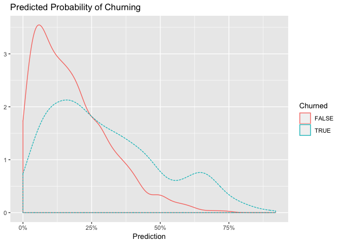
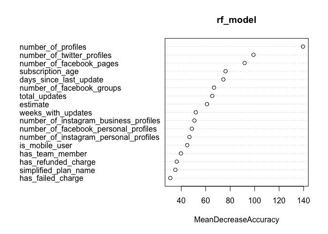
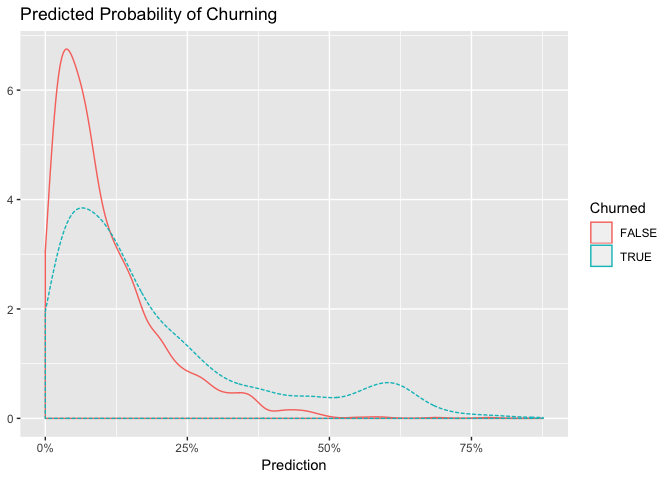
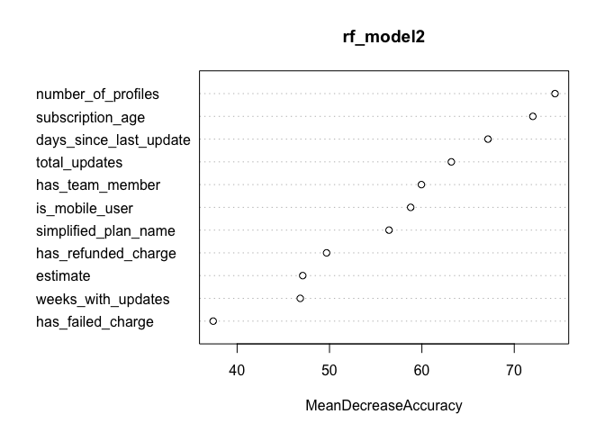
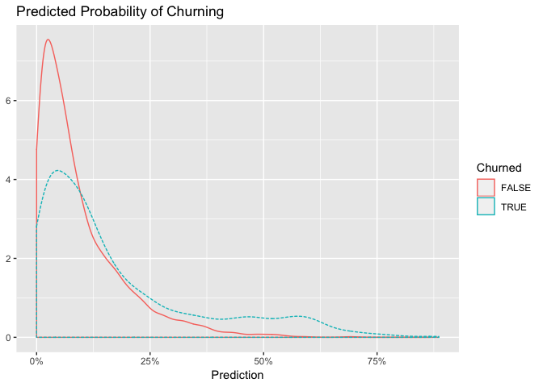

Random Forests
================

The purpose of this notebook is to explore random forest models to establish a baseline model performance and determine which features correlate best with the likelihood of churning. The AUC calculated on the testing set is **0.68**, which is not better than that of the logistic regression mode.

The first thing we'll need to do is gather the data from the `data` directory.

``` r
# read data from csv
subs <- read.csv('~/data/features.csv', header = T)
```

Great, we have 74 thousand subscriptions to work with. To evaluate our models, we'll need to split our data into a training and testing set. First, let's simplify by removing subscriptions billed annually.

``` r
# remove yearly subscriptions 
subs <- filter(subs, billing_interval == 'month' & simplified_plan_name != 'reply')
```

We've already done a lot of exploratory analysis in the [logistic regression](https://github.com/bufferapp/churnado/blob/master/notebooks/logistic_regression.md) notebook, so we'll skip that step in this notebook. I'll start by laying out the motivation for using random forests.

### Motivation for Random Forests

Logistic regression models are unfortunately subject to a few weaknesses:

-   Training variance: this occurs when small changes in the makeup of the training set results in models that make substantially different predictions. Decision trees especially can exhibit this effect. Both bagging and random forests can reduce training variance.

-   Non-monotone effects: logistic regression treats numeric variables in a monotone manner, which isn't always representative of reality. For example, a linear model might find that more updates is a good thing, and that must mean that *many* more updates must be much better. This is not always the case. Generalized additive models add the ability to model more interesting variable effects and ranges to linear models.

These issues don't necessarily cause models to fail. They just leave us with models that aren't as powerful as they could be.

### Random Forests

In bagging, trees are built using randomized datasets, but each tree is built by considering the same set of features - this means that all the individual trees are likely to use very similar sets of features. Therefore all the trees will tend to be overly correlated with each other. If there are regions in the feature space where one tree tends to make mistakes, then all trees are likely to make mistakes there too.

The random forest approach tries to de-correlate trees by randomizing the set of variables that each tree is allowed to use. For each inidividual tree in the ensemble, RF does the following:

-   Draws a bootstrapped sample from the training data
-   For each sample, grow a decision tree, and at each node draw a subset of variables from the features that are available, pick the best variable and the best split from that set, and continue until the tree is fully grown.

The final ensemble of trees is then bagged to make the predictions. Let's build our first RF model. We'll need to define a few new features quickly.

``` r
# define new features
subs <- subs %>% 
  mutate(has_team_member = !is.na(number_of_team_members) & number_of_team_members > 0,
         has_refunded_charge = !is.na(number_of_refunded_charges) & number_of_refunded_charges > 0,
         has_failed_charge = !is.na(number_of_failed_charges) & number_of_failed_charges > 0,
         did_churn = as.factor(did_churn))
```

``` r
# set seed for reproducibility
set.seed(4399)

# set random groups
subs$rgroup <- runif(dim(subs)[[1]])

# split out training and testing sets
training <- subset(subs, rgroup <= 0.8)
testing <- subset(subs, rgroup > 0.8)

# list features
features <- c('has_team_member', 'is_mobile_user', 'number_of_profiles', 'has_refunded_charge',
              'has_failed_charge', 'days_since_last_update', 'estimate', 'weeks_with_updates',
              'estimate', 'total_updates', 'simplified_plan_name', 'subscription_age',
              'number_of_twitter_profiles', 'number_of_facebook_personal_profiles',
              'number_of_facebook_pages', 'number_of_facebook_groups', 'number_of_instagram_personal_profiles',
              'number_of_instagram_business_profiles')

# remove NAs
training <- training %>% 
  select(features, did_churn) %>% 
  na.omit()

# remove NAs from testing set
testing <- testing %>% 
  na.omit()

# set up rf model
rf_model <- randomForest(x = select(training, -did_churn), y = training$did_churn, importance = TRUE)
```

Alright, now let's make predictions on the testing set.

``` r
# make predictions
testing$predictions <- predict(rf_model, newdata = select(testing, features), type = 'prob')[, 2]
```

Now let's create the double density plot to see predictions for users that churned and users that didn't.



Hmm. It looks like a lot of subscriptions that did in fact churn have a low predicted probability of churning. Alright, let's look at the confusion matrix and calculate AUC with a threshold set around 30%.

``` r
# build confusion matrix
confuse <-  table(pred = testing$predictions >= 0.30, churned = testing$did_churn)
confuse
```

    ##        churned
    ## pred    FALSE TRUE
    ##   FALSE  1233  573
    ##   TRUE    275  452

Now we can calculate precision, recall, and enrichment. Precision is defined as the number of true positives divided by the number of true positives plus the number of false positives. False positives are cases the model incorrectly labels as positive that are actually negative, or in our example, individuals the model classifies as terrorists that are not. While recall expresses the ability to find all relevant instances in a dataset, precision expresses the proportion of the data points our model says was relevant actually were relevant.

``` r
# calculate precision
precision <- confuse[2,2] / sum(confuse[2,])
precision
```

    ## [1] 0.6217331

Seems like we have a lot of false positives, but that might be alright. Recall is the number of true positives divided by the number of true positives plus the number of false negatives.

``` r
# calculate recall
recall <- confuse[2,2] / sum(confuse[,2])
recall
```

    ## [1] 0.4409756

The ratio of the classifier precision to the average rate of positives is called the enrichment rate.

``` r
# calculate enrichment rate
enrich <- precision / mean(as.numeric(testing$did_churn))
enrich
```

    ## [1] 0.4426223

Our logistic regression model identifies a set of potential at-risk subscriptions that finds about 55% of all the true at-risk subscriptions, with a true positive rate around 68% higher than the overall population rate.

### AUC

Let's calculate AUC to evaluate our model's performance.

``` r
# define what a positive result is
pos <- TRUE

# function to calculate AUC
calcAUC <- function(predcol, outcol) {
  
  perf <- performance(prediction(predcol, outcol == pos), 'auc') 
  as.numeric(perf@y.values)
  
}

# calculate AUC
calcAUC(testing[, "predictions"], testing[, "did_churn"])
```

    ## [1] 0.6839176

The AUC is around 0.68, which isn't better than our logistic regression model. Let's try to improve our model. We can examine the variable importance in our first model.

``` r
# examine variable importance
var_importance <- importance

# plot importance
varImpPlot(rf_model, type = 1)
```



Wow, for some reason the number of profiles seems to be one of the most important variables. We've seen in our exploratory analysis that this shouldn't be that important of a metric, so let's remove it from our model.

``` r
# list features
features <- c('has_team_member', 'is_mobile_user', 'number_of_profiles', 'has_refunded_charge',
              'has_failed_charge', 'days_since_last_update', 'estimate', 'weeks_with_updates',
              'estimate', 'total_updates', 'simplified_plan_name', 'subscription_age')

# remove NAs
training <- training %>% 
  select(features, did_churn) %>% 
  na.omit()

# remove NAs from testing set
testing <- testing %>% 
  na.omit()

# set up rf model
rf_model2 <- randomForest(x = select(training, -did_churn), y = training$did_churn, importance = TRUE)
```

Now let's make predictions on the testing set.

``` r
# make predictions
testing$pred2 <- predict(rf_model2, newdata = select(testing, features), type = 'prob')[, 2]
```

Now let's create the double density plot to see predictions for users that churned and users that didn't.



Still doesn't look too great. Let's calculate AUC for this second model.

``` r
# calculate AUC
calcAUC(testing[, "pred2"], testing[, "did_churn"])
```

    ## [1] 0.6443165

It's below 0.65. Ouch. Let's look at variable importance again.

``` r
# plot importance
varImpPlot(rf_model2, type = 1)
```



Profiles is still the most important variable? Let's just remove it and see what happens.

``` r
# list features
features <- c('has_team_member', 'is_mobile_user', 'has_refunded_charge',
              'has_failed_charge', 'days_since_last_update', 'estimate', 'weeks_with_updates',
              'estimate', 'total_updates', 'simplified_plan_name', 'subscription_age')

# remove NAs
training <- training %>% 
  select(features, did_churn) %>% 
  na.omit()

# remove NAs from testing set
testing <- testing %>% 
  na.omit()

# set up rf model
rf_model3 <- randomForest(x = select(training, -did_churn), y = training$did_churn, importance = TRUE)
```

Now let's make predictions on the testing set.

``` r
# make predictions
testing$pred3 <- predict(rf_model3, newdata = select(testing, features), type = 'prob')[, 2]
```

Now let's create the double density plot to see predictions for users that churned and users that didn't.



Again, not great.

``` r
# calculate AUC
calcAUC(testing[, "pred3"], testing[, "did_churn"])
```

    ## [1] 0.627593

This is still performing worse than the logistic regression model. What if we used the same features we used in logistic regression?

``` r
# create new features
subs <- subs %>% 
  mutate(no_updates = is.na(total_updates) | total_updates == 0,
         age_scaled = scale(subscription_age))
```

``` r
# set seed for reproducibility
set.seed(4399)

# set random groups
subs$rgroup <- runif(dim(subs)[[1]])

# split out training and testing sets
training <- subset(subs, rgroup <= 0.8)
testing <- subset(subs, rgroup > 0.8)

# list features
features <- c('has_team_member', 'is_mobile_user', 'number_of_profiles', 'has_refunded_charge',
              'has_failed_charge', 'days_since_last_update', 'estimate', 'weeks_with_updates',
              'estimate', 'total_updates', 'simplified_plan_name', 'age_scaled', 'signup_client_name',
              'signup_option', 'no_updates')

# remove NAs
training <- training %>% 
  select(features, did_churn) %>% 
  na.omit()

# remove NAs from testing set
testing <- testing %>% 
  na.omit()

# set up rf model
rf_model4 <- randomForest(x = select(training, -did_churn), y = training$did_churn, importance = TRUE)
```

AUC time.

``` r
# make predictions
testing$pred4 <- predict(rf_model4, newdata = select(testing, features), type = 'prob')[, 2]

# calculate AUC
calcAUC(testing[, "pred4"], testing[, "did_churn"])
```

    ## [1] 0.644692

This still isn't a very good score.
